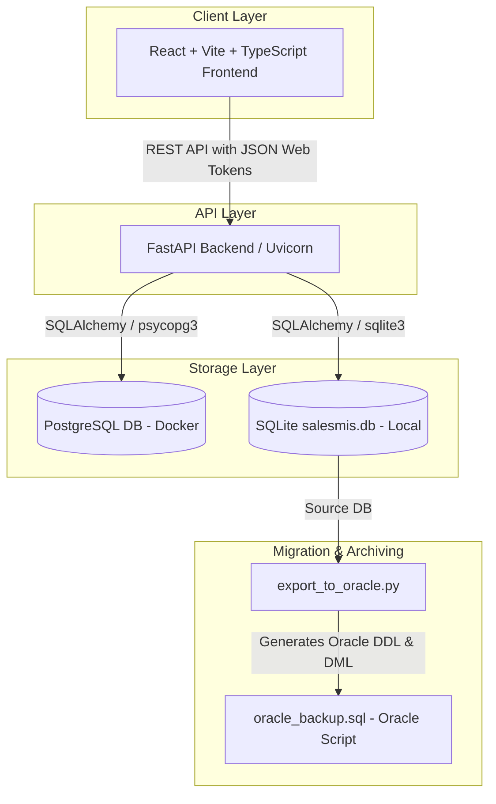

# Sales Management Information System (Sales MIS)

A modern, full-stack Management Information System (MIS) for sales tracking, inventory audit logging, and data analytics. This project features a high-performance **FastAPI** backend with database flexibility (PostgreSQL/SQLite), a clean and responsive **React TypeScript** frontend with **Chart.js** data visualizations, and automated database migration pipelines to **Oracle Database**.

---

## 🏗️ System Architecture



---

## 🌟 Key Features

* **🛡️ Secure JWT Authentication & RBAC**: Automated setup of initial system administrators with secure Argon2 password hashing. Protects sensitive API endpoints.
* **📊 Live Analytics Dashboard**: Rich data visualizations powered by `chart.js` showing sales growth, channel performance, and top-selling products.
* **📦 Product & Inventory Audit Logging**: Every inventory adjustment (sales, returns, manual changes) is tracked with transaction history and user credits inside `inventory_movements` to maintain complete audit logs.
* **👥 Customer Segment Analysis**: Group customers by activity level, company accounts, and segment performance.
* **🛒 Order Management Pipeline**: Track order state changes (Pending, Packed, Shipped, Completed, Delayed) and automatically adjust stock levels.
* **🔄 Oracle Database Portability**: Includes an automated migration script (`export_to_oracle.py`) that exports PostgreSQL/SQLite data directly into Oracle-compatible SQL scripts containing full DDL & DML statements.
* **🐳 Dockerized Orchestration**: Ready-to-go environment for development or production using Docker Compose.

---

## 🛠️ Tech Stack

### Frontend
* **Core Framework**: React 19, TypeScript 6.0
* **Build System**: Vite 8.0 (React Compiler enabled)
* **Routing**: React Router DOM 7.0
* **Charts & Visualizations**: Chart.js 4.5 & React Chart.js 2
* **Styling & Icons**: Lucide React for consistent iconography

### Backend
* **API Framework**: FastAPI (v0.115)
* **ASGI Server**: Uvicorn
* **Database ORM**: SQLAlchemy 2.0
* **Driver**: psycopg 3 (binary) for PostgreSQL compatibility
* **Securing Mechanisms**: PyJWT & Argon2 (via pwdlib)
* **Config Management**: Pydantic Settings

---

## 🚀 Quick Start with Docker

The easiest way to get the entire system running is using Docker Compose:

1. **Clone & Spin Up Containers**:
   From the repository root directory, run:
   ```bash
   docker compose up --build
   ```

2. **Access Interfaces**:
   * **Frontend Web Application**: [http://localhost:8080](http://localhost:8080)
   * **FastAPI Swagger API Documentation**: [http://localhost:8000/docs](http://localhost:8000/docs)
   * **API Health Check Endpoint**: [http://localhost:8000/health](http://localhost:8000/health)

3. **Default Login Credentials**:
   * **Docker Initial Admin**:
     * **Email**: `ahzarky@gmail.com`
     * **Password**: `123456`
   * **Local Server Initial Admin**:
     * **Email**: `admin@salesmis.com`
     * **Password**: `change-this-password`

> [!IMPORTANT]
> Change the default administrator credentials and update the `JWT_SECRET_KEY` in environment configurations prior to production deployment.

---

## 💻 Local Development Setup

If you prefer to run the components independently on your host machine:

### 🐍 Backend Service Setup
1. Navigate to the backend directory:
   ```bash
   cd backend
   ```
2. Copy the environment variables template:
   ```bash
   cp .env.example .env
   ```
3. Set up a Python virtual environment and activate it:
   ```bash
   python3 -m venv .venv
   source .venv/bin/activate
   ```
4. Install dependencies:
   ```bash
   pip install -r requirements.txt
   ```
5. Run the FastAPI development server:
   ```bash
   uvicorn app.main:app --reload
   ```

### ⚛️ Frontend React Setup
1. Navigate to the frontend directory:
   ```bash
   cd frontend
   ```
2. Install npm dependencies:
   ```bash
   npm install
   ```
3. Start the Vite hot-reloading development server:
   ```bash
   npm run dev
   ```
4. Open the displayed URL (typically [http://localhost:5173](http://localhost:5173)).

---

## 🗄️ Database Management & Client Connections

### Local SQLite Database
* During local runs (outside Docker), the app initializes an SQLite database file: `backend/salesmis.db`.
* Good for fast tests and prototyping without dependencies.

### PostgreSQL Database
* The Docker environment runs standard PostgreSQL 16 on alpine.
* It binds PostgreSQL to the local port **`5433`** (exposing it externally) to prevent port collisions if you are running an existing PostgreSQL service locally.

#### Connect via DB Clients (e.g., Navicat)
To inspect the PostgreSQL database using Navicat, DBeaver, or another client, create a new PostgreSQL connection:

| Setting | Value |
| --- | --- |
| **Host** | `localhost` |
| **Port** | `5433` |
| **Database** | `salesmis` |
| **User Name** | `salesmis` |
| **Password** | `salesmis` |

---

## 🔄 Oracle Migration Pipeline

The project includes a robust migration utility (`backend/export_to_oracle.py`) which acts as a bridge to enterprise databases. It translates SQLite/PostgreSQL schemas and data directly into **Oracle Database** dialect.

To perform a migration:
1. Ensure the SQLite database `backend/salesmis.db` contains data (e.g., run the backend once with `SEED_DEMO_DATA=True`).
2. Run the script:
   ```bash
   cd backend
   python export_to_oracle.py
   ```
3. This creates a highly optimized database backup file `oracle_backup.sql` at the root directory level.
4. Execute the SQL script on your Oracle DB cluster to drop existing entities, instantiate Oracle tables with appropriate constraints (sequences, identities, checks), and ingest the data.

---

## 🔌 API Endpoints Map

All secured endpoints require authentication headers: `Authorization: Bearer <JWT_TOKEN>`.

| Route | Method | Description |
| --- | --- | --- |
| `/api/auth/login` | `POST` | Authenticate user and retrieve JWT access token |
| `/api/auth/register` | `POST` | Self-register a new account |
| `/api/products` | `GET` / `POST` | Fetch all products or create a new inventory item |
| `/api/customers` | `GET` / `POST` | Manage customer records and company association |
| `/api/orders` | `GET` / `POST` | View sales history or log new transactions |
| `/api/inventory/{product_id}/adjust` | `POST` | Manually increment or decrement stock (generates movements logs) |
| `/api/analytics/dashboard` | `GET` | Aggregated telemetry data for React charts |
| `/api/reports/sales` | `GET` | Export sales transactions and totals |
